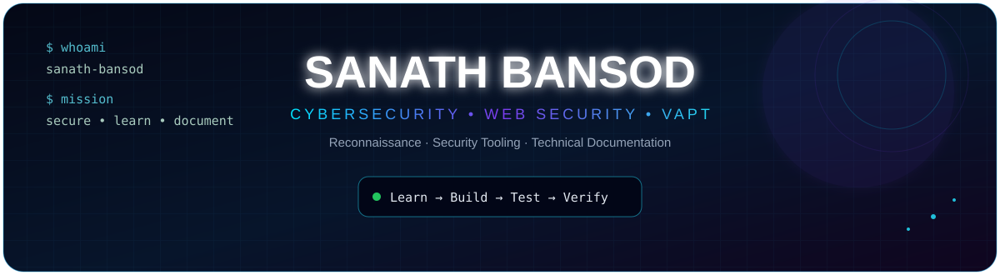
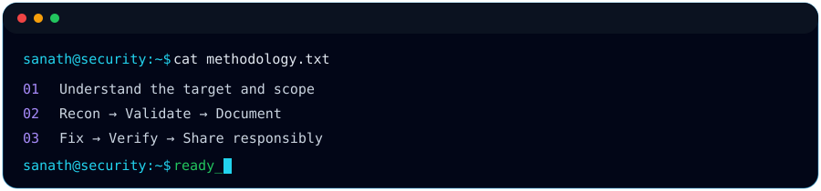

<div align="center">



<br>

<a href="https://github.com/SanathBansod"></a>
<a href="https://www.linkedin.com/in/sanathbansod53/"></a>


### `SECURE • EXPLORE • LEARN • DOCUMENT`

</div>


## 👨‍💻 About Me

> **Aspiring Cybersecurity Professional** focused on practical **Web Application Security, VAPT, reconnaissance, and security tooling**.
>
> I like taking a problem from **first observation → investigation → root cause → verification → documentation**, so every project becomes something reproducible and useful.

<div align="center">

</div>

## ⚡ Core Skills & Security Toolkit

| Domain | Tools / Technologies |
|---|---|
| 🌐 Web Security | Burp Suite • OWASP • HTTP fundamentals |
| 🔎 Reconnaissance | Nmap • ParamSpider • SecLists |
| 🧪 VAPT | Metasploit Framework • Vulnerability Assessment |
| 🛡️ Detection | Snort IDS • Log Analysis |
| 📊 SIEM | Splunk • SSH Authentication Analysis |
| 🐧 Environment | Kali Linux • Linux • Bash |
| 💻 Development | Python • Git • GitHub |

## 🎯 Current Focus

```text
Web Application Security       ████████████████████░  Building
Reconnaissance & OSINT         ███████████████████░░  Building
VAPT & Methodology             ██████████████████░░░  Building
Security Tooling                █████████████████░░░░  Building
Technical Documentation         ████████████████████░  Building
```

## 🚀 Featured Projects

<!-- PROJECTS:START -->
### 🔄 Latest Public Projects

<table>
<tr>
<td width="50%" valign="top">

### 🔹 [SpectraRecon](https://github.com/SanathBansod/SpectraRecon)

Advanced Reconnaissance &amp; Attack-Surface Discovery Framework

**Stack:** `Python`  ·  **⭐** 0  ·  **🍴** 0  
**Updated:** `2026-09-13`

</td>
<td width="50%" valign="top">

### 🔹 [ParamSpider-Kali-Setup](https://github.com/SanathBansod/ParamSpider-Kali-Setup)

A practical Kali Linux setup, troubleshooting, and documentation guide for ParamSpider.

**Stack:** `Security / Research`  ·  **⭐** 0  ·  **🍴** 0  
**Updated:** `2026-09-12`

</td>
</tr>
<tr>
<td width="50%" valign="top">

### 🔹 [splunk-ssh-log-analysis](https://github.com/SanathBansod/splunk-ssh-log-analysis)

🔐 Splunk-based SSH authentication log analysis to identify failed login patterns, suspicious source IPs, targeted accounts, and potential brute-force activity.

**Stack:** `Security / Research`  ·  **⭐** 0  ·  **🍴** 0  
**Updated:** `2026-09-07`

</td>
<td width="50%" valign="top">

### 🔹 [Snort-IDS](https://github.com/SanathBansod/Snort-IDS)

Hands-on Snort IDS laboratory covering installation, configuration, custom rules, ICMP detection, port scan detection, SSH brute-force detection, and alert analysis.

**Stack:** `Security / Research`  ·  **⭐** 0  ·  **🍴** 0  
**Updated:** `2026-08-24`

</td>
</tr>
<tr>
<td width="50%" valign="top">

### 🔹 [Metasploit-Bind-Reverse-Shell](https://github.com/SanathBansod/Metasploit-Bind-Reverse-Shell)

Hands-on lab demonstrating reverse TCP, bind TCP, Meterpreter payloads, msfvenom, Multi/Handler, and post-exploitation using Metasploit Framework.

**Stack:** `Security / Research`  ·  **⭐** 0  ·  **🍴** 0  
**Updated:** `2026-08-12`

</td>
<td width="50%" valign="top">

### 🔹 [Metasploit-Vulnerability-Assessment](https://github.com/SanathBansod/Metasploit-Vulnerability-Assessment)

Practical vulnerability assessment and penetration testing of an authorized Metasploitable 2 laboratory environment using Metasploit Framework.

**Stack:** `Security / Research`  ·  **⭐** 0  ·  **🍴** 0  
**Updated:** `2026-08-12`

</td>
</tr>
<tr>
<td width="50%" valign="top">

### 🔹 [Nmap-Network-Scanning](https://github.com/SanathBansod/Nmap-Network-Scanning)

Practical network reconnaissance and enumeration using Nmap in an authorized Metasploitable laboratory environment.

**Stack:** `Security / Research`  ·  **⭐** 0  ·  **🍴** 0  
**Updated:** `2026-08-10`

</td>
<td width="50%"></td>
</tr>
</table>

_Automatically generated from the public repositories of **SanathBansod**._
<!-- PROJECTS:END -->


## 📌 What You'll Find Here

- 🔬 Hands-on security labs and practical experiments
- 🧰 Tool setup, configuration, and troubleshooting
- 📸 Evidence, screenshots, and reproducible steps
- 🧠 Root-cause analysis instead of copy-paste commands
- 📝 Technical write-ups and lessons learned
- 🔐 Responsible, authorized security testing

## 📈 GitHub Activity

<div align="center">

<a href="https://github.com/SanathBansod">
  
</a>
<a href="https://github.com/SanathBansod">
  
</a>

<br><br>


</div>

## 🤝 Let's Connect

<div align="center">

<a href="https://www.linkedin.com/in/sanathbansod53/"></a>
<a href="https://github.com/SanathBansod"></a>

<br><br>

### `Learn → Build → Test → Investigate → Fix → Verify → Document`

<sub>All security work shown here is intended for authorized labs, educational environments, and responsible security research.</sub>

</div>
